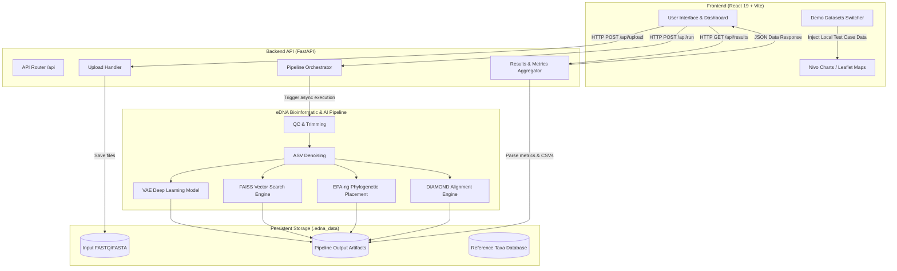
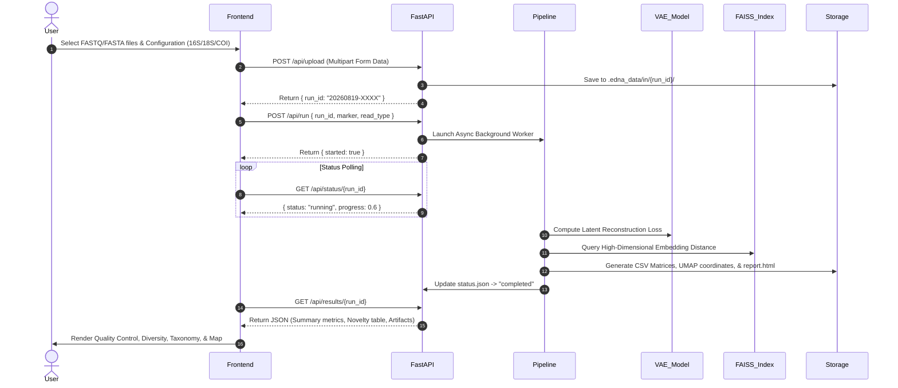

# 🌊 AQUADEX-EDNA: Advanced AI-Powered eDNA Genomics & Discovery Platform

[](https://www.python.org/)
[](https://fastapi.tiangolo.com/)
[](https://react.dev/)
[](https://vitejs.dev/)
[](LICENSE)

**AQUADEX-EDNA** is an end-to-end bioinformatic pipeline, deep learning analysis system, and web platform engineered for processing **Environmental DNA (eDNA)** sequencing datasets. It automates quality control, amplicon sequence variant (ASV) inference, taxonomic classification, and **AI-driven novel species candidate detection** across marine and freshwater ecosystems.

---

## 📋 Table of Contents

1. [Architecture & System Overview](#-architecture--system-overview)
2. [End-to-End eDNA Data Pipeline](#-end-to-end-edna-data-pipeline)
3. [Machine Learning & Novelty Detection Architecture](#-machine-learning--novelty-detection-architecture)
4. [Tech Stack Breakdown](#-tech-stack-breakdown)
5. [Repository Structure](#-repository-structure)
6. [Pre-Configured Scientific Test Cases (Demo Mode)](#-pre-configured-scientific-test-cases-demo-mode)
7. [Installation & Quick Start Guide](#-installation--quick-start-guide)
8. [API Reference & Contracts](#-api-reference--contracts)
9. [Environment Variable Configuration](#-environment-variable-configuration)
10. [Deployment & Containerization](#-deployment--containerization)
11. [Troubleshooting & FAQ](#-troubleshooting--faq)

---

## 🏗️ Architecture & System Overview

AQUADEX-EDNA follows a decoupled microservice-ready architecture comprising an asynchronous **FastAPI service** for pipeline orchestration and data serving, alongside a high-performance **React + Vite single-page application (SPA)** for scientific visualization.



---

## 🧬 End-to-End eDNA Data Pipeline

The core analysis pipeline ingests raw high-throughput sequencing reads (`.fasta`, `.fastq`, `.gz`) and executes a multi-stage bioinformatic workflow:



---

## 🤖 Machine Learning & Novelty Detection Architecture

A primary innovation of AQUADEX-EDNA is its **AI-assisted Novel Taxa Detection Engine**. Traditional taxonomy classifiers fail or provide low-confidence assignments when encountering previously unsequenced organisms. AQUADEX overcomes this limitation using dual complementary models:

```text
                 ┌──────────────────────────────────────────────┐
                 │       Amplicon Sequence Variant (ASV)        │
                 └──────────────────────┬───────────────────────┘
                                        │
                    ┌───────────────────┴───────────────────┐
                    ▼                                       ▼
    ┌───────────────────────────────┐       ┌───────────────────────────────┐
    │  Variational Autoencoder      │       │ FAISS High-Dimensional Vector │
    │  (VAE) Latent Reconstruction  │       │ Similarity Distance Query     │
    └───────────────┬───────────────┘       └───────────────┬───────────────┘
                    │ Reconstruction Loss                   │ Vector Cosine Distance
                    ▼                                       ▼
    ┌───────────────────────────────────────────────────────────────────────┐
    │                 Composite Novelty Score Calculation                   │
    │  Score = w1 * Norm(VAE_Loss) + w2 * Norm(FAISS_Dist) - w3 * DIAMOND   │
    └───────────────────────────────────┬───────────────────────────────────┘
                                        │
                                        ▼
    ┌───────────────────────────────────────────────────────────────────────┐
    │ High Confidence Candidate Filter (Score ≥ 0.70 & DIAMOND Hit == No)   │
    └───────────────────────────────────────────────────────────────────────┘
```

1. **Variational Autoencoder (VAE)**: Trained on reference 16S/18S/COI sequence embeddings. High reconstruction error (`vaeloss > 0.7`) indicates structural divergence from known sequence space.
2. **FAISS Vector Search Engine**: Queries 128-dimensional sequence embeddings against an indexed database of millions of cataloged microbial sequences. Distances `faissDist > 0.8` signal distant relationship to existing clades.
3. **DIAMOND & EPA-ng Verification**: Cross-references hits against DIAMOND protein/nucleotide alignment and EPA-ng phylogenetic trees to eliminate false positives.

---

## 💻 Tech Stack Breakdown

### Backend
- **Framework**: [FastAPI 0.115.0](https://fastapi.tiangolo.com/) (Python 3.11 / 3.12)
- **ASGI Server**: [Uvicorn 0.30.6](https://www.uvicorn.org/) with WatchFiles auto-reload
- **Data Validation**: [Pydantic v2.9.2](https://docs.pydantic.dev/) & Pydantic-Settings
- **JSON Serialization**: Orjson (High-performance C-based JSON parser)
- **Storage Strategy**: Local filesystem management under `.edna_data/`

### Frontend
- **Framework**: [React 19.1.1](https://react.dev/) + [Vite 7.1.4](https://vitejs.dev/)
- **Data Visualization**: [@nivo/pie](https://nivo.rocks/pie/), [@nivo/bar](https://nivo.rocks/bar/), [@nivo/heatmap](https://nivo.rocks/heatmap/), [@nivo/scatterplot](https://nivo.rocks/scatterplot/), [@nivo/sankey](https://nivo.rocks/sankey/)
- **Geospatial Mapping**: [Leaflet 1.9.4](https://leafletjs.com/) + [React-Leaflet 5.0.0](https://react-leaflet.js.org/)
- **Icons & UI**: [Lucide-React 0.544.0](https://lucide.dev/)
- **Styling**: Vanilla CSS3 with modular variables and responsive flex/grid layouts

---

## 📂 Repository Structure

```text
c:\projects\AQUADEX-main\AQUADEX-main\
├── README.md                               # Platform documentation
├── render.yaml                             # Production deployment configuration
├── package.json                            # Workspace package definitions
├── Screenshot *.png                        # Application visual previews
│
├── EDNA/
│   ├── backend_EDNA/                       # Python FastAPI Microservice
│   │   ├── app/
│   │   │   ├── main.py                     # App factory, CORS middleware, router registration
│   │   │   ├── api/
│   │   │   │   └── routes.py               # REST API endpoints (/upload, /run, /status, /results)
│   │   │   ├── core/
│   │   │   │   └── config.py               # Pydantic Settings & environment variables
│   │   │   ├── models/
│   │   │   │   └── schemas.py              # UploadResponse, RunRequest, ResultsResponse schemas
│   │   │   ├── services/
│   │   │   │   ├── pipeline.py             # Asynchronous thread pipeline execution
│   │   │   │   ├── results.py              # Results parser & demo data fallback handler
│   │   │   │   └── storage.py              # Directory initialization & run workspace paths
│   │   │   └── utils/
│   │   │       └── run_id.py               # Timestamped unique run ID generator
│   │   ├── data_OP/                        # Default dummy cluster PNG fallback assets
│   │   ├── Dockerfile                      # Containerization recipe
│   │   ├── requirements.txt                # Python package manifests
│   │   └── .env.example                    # Sample environment configurations
│   │
│   └── frontend_EDNA/                      # React SPA Frontend
│       ├── public/
│       │   └── assets/                     # Public video assets, map textures, & diagrams
│       ├── src/
│       │   ├── App.jsx                     # Root router & global state container
│       │   ├── main.jsx                    # Vite entry point
│       │   ├── index.css                   # Global styles & design variables
│       │   ├── components/
│       │   │   ├── Header.jsx              # Navigation header with login modal trigger
│       │   │   ├── Footer.jsx              # App footer
│       │   │   ├── FeaturesSection.jsx     # Platform features showcase grid
│       │   │   ├── SolutionCard.jsx        # Solution workflow cards
│       │   │   └── WhyChoose.jsx           # Value proposition section
│       │   ├── pages/
│       │   │   ├── Home.jsx                # Landing page with video hero & typewriter effect
│       │   │   ├── Run.jsx                 # Sequence upload & pipeline configuration
│       │   │   ├── Results.jsx             # Analysis dashboard (QC, Diversity, Taxonomy, Novelty)
│       │   │   ├── mappage.jsx             # Geospatial discovery map with Leaflet
│       │   │   ├── Results.css             # Dashboard visualization styles
│       │   │   ├── run.css                 # Upload & run page styles
│       │   │   ├── home.css                # Landing page styles
│       │   │   └── mappage.css             # Discovery map page styles
│       │   └── utils/
│       │       ├── config.js               # API URL endpoint provider
│       │       └── demoDatasets.js         # Curated deep-sea demo test case datasets
│       ├── package.json                    # Node dependencies & scripts
│       └── vite.config.js                  # Vite builder configuration
│
└── .edna_data/                             # Local runtime storage (Git-ignored)
    ├── in/                                 # Uploaded FASTA/FASTQ sequence inputs
    ├── out/                                # Generated metrics, CSVs, & HTML reports
    ├── db/                                 # Reference database files
    └── tmp/                                # Temporary scratch directory
```

---

## 🧪 Pre-Configured Scientific Test Cases (Demo Mode)

To explore the platform immediately without uploading large FASTQ sequence files, AQUADEX includes **3 curated deep-sea test cases**:

| Dataset ID | Scientific Target | Depth | Coordinates / Region | Reads Count | Novel Candidates |
| :--- | :--- | :--- | :--- | :--- | :--- |
| **`demo-abyssal`** | Abyssal Plain Benthic Sediment | 4,120m | Clarion-Clipperton Zone (13.14°N, 126.85°W) | 142,850 | 14 ASVs |
| **`demo-hydrothermal`** | Mariana Chimney Microbiome | 2,750m | Mariana Arc Vent Field (18.25°N, 144.73°E) | 215,400 | 28 ASVs |
| **`demo-coral-twilight`**| Mesopelagic Eukaryote Survey | 650m | Coral Sea Basin (17.52°S, 151.38°E) | 98,600 | 8 ASVs |

---

## 🚀 Installation & Quick Start Guide

### Prerequisites

- **Python**: `v3.11+`
- **Node.js**: `v18+` (npm `v9+`)
- **Git**: `v2.30+`

---

### Step 1: Clone Repository

```bash
git clone https://github.com/Aadarshsingh16/AQUADEX-EDNA.git
cd AQUADEX-EDNA/AQUADEX-main
```

---

### Step 2: Backend Setup (FastAPI)

```bash
# Navigate to backend folder
cd EDNA/backend_EDNA

# Create and activate Python virtual environment
python -m venv .venv

# Windows (PowerShell)
.venv\Scripts\activate

# Linux / macOS
source .venv/bin/activate

# Install required dependencies
pip install -r requirements.txt

# Copy environment settings
cp .env.example .env

# Launch Backend Dev Server
python -m uvicorn app.main:app --host 127.0.0.1 --port 8000 --reload
```

Verify backend execution at: [http://127.0.0.1:8000/health](http://127.0.0.1:8000/health).

---

### Step 3: Frontend Setup (React + Vite)

Open a second terminal window:

```bash
# Navigate to frontend folder
cd AQUADEX-main/EDNA/frontend_EDNA

# Install Node dependencies
npm install

# Start Vite Dev Server
npm run dev
```

Open your browser at: [http://localhost:5173](http://localhost:5173).

---

## 📡 API Reference & Contracts

### Base URL: `http://127.0.0.1:8000`

#### 1. Server Health Check
- **`GET /health`**
- **Response `200 OK`**:
```json
{
  "ok": true
}
```

#### 2. Upload Sequence Files
- **`POST /api/upload`**
- **Request**: `multipart/form-data` with `files` field.
- **Response `200 OK`**:
```json
{
  "run_id": "20260819-2132-953YS4",
  "saved_files": ["sample_R1.fasta", "sample_R2.fasta"]
}
```

#### 3. Launch Analysis Pipeline
- **`POST /api/run`**
- **Request Body**:
```json
{
  "run_id": "20260819-2132-953YS4",
  "marker": "16S",
  "read_type": "short",
  "options": {}
}
```
- **Response `200 OK`**:
```json
{
  "run_id": "20260819-2132-953YS4",
  "started": true,
  "message": "Pipeline launched"
}
```

#### 4. Poll Execution Status
- **`GET /api/status/{run_id}`**
- **Response `200 OK`**:
```json
{
  "run_id": "20260819-2132-953YS4",
  "status": "running",
  "progress": 0.60,
  "message": "Novelty detection..."
}
```

#### 5. Fetch Full Results & Metrics
- **`GET /api/results/{run_id}`**
- **Response `200 OK`**:
```json
{
  "run_id": "demo-abyssal",
  "summaryMetrics": [
    { "label": "% ASVs assigned per rank", "value": "94.2%" },
    { "label": "Shannon Diversity", "value": "4.82" },
    { "label": "Simpson Diversity", "value": "0.94" },
    { "label": "# Novel ASVs detected", "value": "14" }
  ],
  "noveltyTable": [
    {
      "id": "ASV_ABYSSAL_001",
      "noveltyScore": "0.94",
      "vaeloss": "0.88",
      "faissDist": "0.92",
      "epaAnnotation": "Uncultured Deep-Sea Archaeon",
      "diamondHit": "No",
      "abundance": "342",
      "depth": "4120",
      "location": "Pacific CCZ Station A1"
    }
  ],
  "artifacts": [
    { "filename": "abundance.csv", "url": "/api/artifacts/demo-abyssal/asvs/abundance.csv" },
    { "filename": "report.html", "url": "/api/artifacts/demo-abyssal/reports/report.html" }
  ]
}
```

---

## ⚙️ Environment Variable Configuration

### Backend (`EDNA/backend_EDNA/.env`)

| Variable | Type | Description | Default Example |
| :--- | :--- | :--- | :--- |
| `DATA_IN` | Path | Directory for uploaded raw fasta/fastq files | `c:/projects/AQUADEX-main/AQUADEX-main/.edna_data/in` |
| `DATA_OUT` | Path | Directory for output matrices, logs, and reports | `c:/projects/AQUADEX-main/AQUADEX-main/.edna_data/out` |
| `DATA_DB` | Path | Directory for reference taxonomy databases | `c:/projects/AQUADEX-main/AQUADEX-main/.edna_data/db` |
| `DATA_TMP` | Path | Directory for scratch files during pipeline execution | `c:/projects/AQUADEX-main/AQUADEX-main/.edna_data/tmp` |
| `PIPELINE_CMD` | String | Command template forNextflow/Docker pipeline | `echo Pipeline command goes here` |
| `ARTIFACT_BASE_URL` | String | Base route for downloadable artifacts | `/api/artifacts` |

---

## 🐳 Deployment & Containerization

### Render.com Deployment (`render.yaml`)

The repository includes a production-ready `render.yaml` configuration:

```yaml
services:
  - type: web
    name: aquadex-backend
    env: python
    buildCommand: pip install -r EDNA/backend_EDNA/requirements.txt
    startCommand: uvicorn EDNA.backend_EDNA.app.main:app --host 0.0.0.0 --port $PORT
```

### Docker Build

```bash
cd EDNA/backend_EDNA
docker build -t aquadex-backend:latest .
docker run -d -p 8000:8000 --name aquadex-backend aquadex-backend:latest
```

---

## ❓ Troubleshooting & FAQ

#### 1. Port 8000 is already in use
If Uvicorn fails to start because port `8000` is bound by another process:
```bash
python -m uvicorn app.main:app --host 127.0.0.1 --port 8080 --reload
```

#### 2. CORS policy errors on Frontend
Ensure `app.main:app` has CORS middleware configured:
```python
app.add_middleware(
    CORSMiddleware,
    allow_origins=["http://localhost:5173", "http://localhost:5174", "*"],
    allow_credentials=True,
    allow_methods=["*"],
    allow_headers=["*"],
)
```

#### 3. Leaflet tiles not loading on Discovery Map
Verify that internet connectivity is enabled for fetching OpenStreetMap tiles or map textures under `public/assets/images/world-map.jpg`.

---

## 📜 License

Distributed under the **MIT License**. See `LICENSE` for more information.
